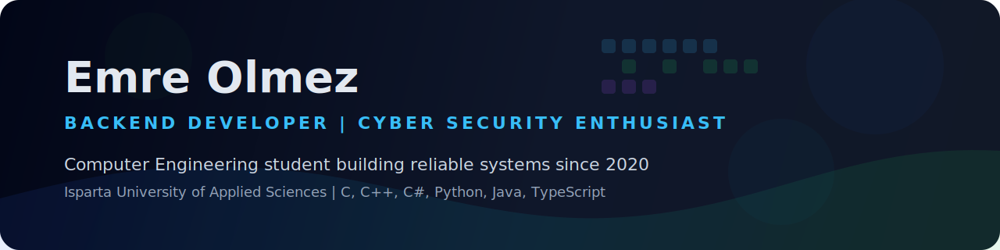
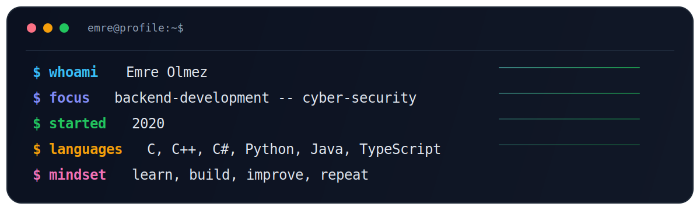

  

  <strong>Building backend systems, exploring cyber security, and growing through consistent practice.</strong>

  
  
  

  
  
  

  

## About Me

I am Emre Olmez, a Computer Engineering student at Isparta University of Applied Sciences. I have been actively working with software since 2020, and I am currently sharpening my skills in backend development and cyber security.

I enjoy building reliable systems, understanding how things work under the hood, and continuously improving both my technical depth and problem-solving mindset.

<table>
  <tr>
    <td valign="top" width="50%">
      <h3>Current Focus</h3>
      <ul>
        <li>Backend development and API design</li>
        <li>Secure software development practices</li>
        <li>Cyber security fundamentals and defensive thinking</li>
        <li>Writing cleaner, more maintainable code</li>
      </ul>
    </td>
    <td valign="top" width="50%">
      <h3>What Describes Me</h3>
      <ul>
        <li>Curious, disciplined, and improvement-driven</li>
        <li>Interested in system design and technical depth</li>
        <li>Focused on long-term growth in engineering</li>
        <li>Always learning by building and practicing</li>
      </ul>
    </td>
  </tr>
</table>

## Profile Snapshot

<table>
  <tr>
    <td width="33%" align="center">
      <strong>Education</strong>  
      Computer Engineering 
      Isparta University of Applied Sciences
    </td>
    <td width="33%" align="center">
      <strong>Main Direction</strong>  
      Backend Development 
      Cyber Security
    </td>
    <td width="33%" align="center">
      <strong>Experience Path</strong>  
      Working with software since 2020 
      Learning by building
    </td>
  </tr>
</table>

## Tech Stack

### Languages

  
  
  
  
  
  

## What I Value

- Writing code that is clear, maintainable, and reliable
- Learning the logic behind systems instead of memorizing tools
- Improving steadily through hands-on projects and real practice
- Combining engineering discipline with a security mindset

## Contribution Activity

  <picture>
    <source media="(prefers-color-scheme: dark)" srcset="https://raw.githubusercontent.com/Emre-Olmez/Emre-Olmez/output/github-contribution-grid-snake-dark.svg" />
    <source media="(prefers-color-scheme: light)" srcset="https://raw.githubusercontent.com/Emre-Olmez/Emre-Olmez/output/github-contribution-grid-snake.svg" />
    
  </picture>

## Connect With Me

- LinkedIn: [emre-olmez-59b24a331](https://www.linkedin.com/in/emre-%C3%B6lmez-59b24a331/)
- Instagram: [@emreolmez_0](https://www.instagram.com/emreolmez_0/)
- Email: [emreolmez0032@gmail.com](mailto:emreolmez0032@gmail.com)

  <strong>Always learning, always building.</strong>

